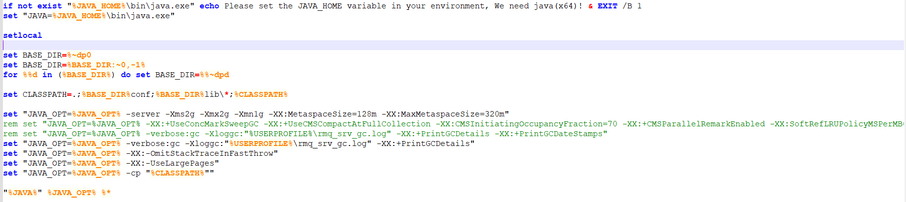
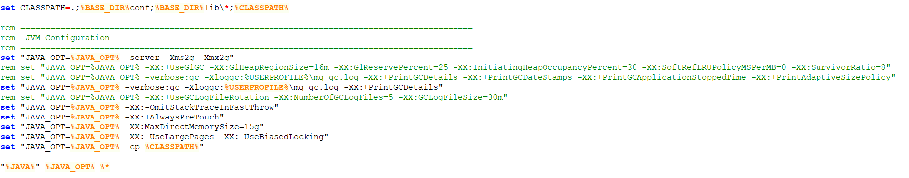

## Apache RocketMQ

## Quick Start

This paragraph guides you through steps of installing RocketMQ in different ways.
For local development and testing, only one instance will be created for each component.

### Run RocketMQ locally

RocketMQ runs on all major operating systems and requires only a Java JDK version 8 or higher to be installed.
To check, run `java -version`:
```shell
$ java -version
java version "1.8.0_121"
```
下面的启动不支持jdk1.8以上的版本，需要修改启动脚本
windows下JDK11修改runserver.cmd

windows下JDK11修改runbroker.cmd

For Windows users, click [here](https://archive.apache.org/dist/rocketmq/4.9.3/rocketmq-all-4.9.3-bin-release.zip) to download the 4.9.3 RocketMQ binary release,
unpack it to your local disk, such as `D:\rocketmq`.
For macOS and Linux users, execute following commands:
```shell
# Download release from the Apache mirror
$ wget https://archive.apache.org/dist/rocketmq/4.9.3/rocketmq-all-4.9.3-bin-release.zip

# Unpack the release
$ unzip rocketmq-all-4.9.3-bin-release.zip
```

Prepare a terminal and change to the extracted `bin` directory:
```shell
$ cd rocketmq-4.9.3/bin
```

**1) Start NameServer**

NameServer will be listening at `0.0.0.0:9876`, make sure that the port is not used by others on the local machine, and then do as follows.

For macOS and Linux users:
```shell
### start Name Server
$ nohup sh mqnamesrv &

### check whether Name Server is successfully started
$ tail -f ~/logs/rocketmqlogs/namesrv.log
The Name Server boot success...
```

For Windows users, you need set environment variables first:
- From the desktop, right click the Computer icon.
- Choose Properties from the context menu.
- Click the Advanced system settings link.
- Click Environment Variables.
- Add Environment `ROCKETMQ_HOME="D:\rocketmq"`. 

Then change directory to rocketmq, type and run:
```shell
$ mqnamesrv.cmd
The Name Server boot success...
```

**2) Start Broker**

For macOS and Linux users:
```shell
### start Broker
$ nohup sh bin/mqbroker -n localhost:9876 &

### check whether Broker is successfully started, eg: Broker's IP is 192.168.1.2, Broker's name is broker-a
$ tail -f ~/logs/rocketmqlogs/broker.log
The broker[broker-a, 192.169.1.2:10911] boot success...
```

For Windows users:
```shell
$ mqbroker.cmd -n localhost:9876
The broker[broker-a, 192.169.1.2:10911] boot success...
```

### Run RocketMQ in Docker

You can run RocketMQ on your own machine within Docker containers,
`host` network will be used to expose listening port in the container.

**1) Start NameServer**

```shell
$ docker run -it --net=host apache/rocketmq ./mqnamesrv
```

**2) Start Broker**

```shell
$ docker run -it --net=host --mount source=/tmp/store,target=/home/rocketmq/store apache/rocketmq ./mqbroker -n localhost:9876
```

### Run RocketMQ in Kubernetes

You can also run a RocketMQ cluster within a Kubernetes cluster using [RocketMQ Operator](https://github.com/apache/rocketmq-operator).
Before your operations, make sure that `kubectl` and related kubeconfig file installed on your machine.

**1) Install CRDs**
```shell
### install CRDs
$ git clone https://github.com/apache/rocketmq-operator
$ cd rocketmq-operator && make deploy

### check whether CRDs is successfully installed
$ kubectl get crd | grep rocketmq.apache.org
brokers.rocketmq.apache.org                 2022-05-12T09:23:18Z
consoles.rocketmq.apache.org                2022-05-12T09:23:19Z
nameservices.rocketmq.apache.org            2022-05-12T09:23:18Z
topictransfers.rocketmq.apache.org          2022-05-12T09:23:19Z

### check whether operator is running
$ kubectl get pods | grep rocketmq-operator
rocketmq-operator-6f65c77c49-8hwmj   1/1     Running   0          93s
```

**2) Create Cluster Instance**
```shell
### create RocketMQ cluster resource
$ cd example && kubectl create -f rocketmq_v1alpha1_rocketmq_cluster.yaml

### check whether cluster resources is running
$ kubectl get sts
NAME                 READY   AGE
broker-0-master      1/1     107m
broker-0-replica-1   1/1     107m
name-service         1/1     107m
```

##Apache RocketMQ Dashboard

###Quick Start

####Run with docker
*	Pull from docker hub(rocketmq-dashboard)
```shell
docker pull apacherocketmq/rocketmq-dashboard:latest
```
####Run it (use your own rocketmq.namesrv.addr and port)
```shell
docker run -d --name rocketmq-dashboard -e "JAVA_OPTS=-Drocketmq.namesrv.addr=127.0.0.1:9876" -p 8080:8080 -t apacherocketmq/rocketmq-dashboard:latest
```
[http://localhost:8080]
---
## Apache RocketMQ Community
* [RocketMQ Streams](https://github.com/apache/rocketmq-streams): A lightweight stream computing engine based on Apache RocketMQ.
* [RocketMQ Flink](https://github.com/apache/rocketmq-flink): The Apache RocketMQ connector of Apache Flink that supports source and sink connector in data stream and Table.
* RocketMQ Muli-Language Clients
	 - [RocketMQ Client CPP](https://github.com/apache/rocketmq-client-cpp)
	 - [RocketMQ Client Go](https://github.com/apache/rocketmq-client-go)
	 - [RocketMQ Client Python](https://github.com/apache/rocketmq-client-python)
	 - [RocketMQ Client Nodejs](https://github.com/apache/rocketmq-client-nodejs)
* [RocketMQ Spring](https://github.com/apache/rocketmq-spring): A project which helps developers quickly integrate Apache RocketMQ with Spring Boot.
* [RocketMQ Exporter](https://github.com/apache/rocketmq-exporter): An Apache RocketMQ exporter for Prometheus.
* [RocketMQ Operator](https://github.com/apache/rocketmq-operator): Providing a way to run an Apache RocketMQ cluster on Kubernetes.
* [RocketMQ Docker](https://github.com/apache/rocketmq-docker): The Git repo of the Docker Image for Apache RocketMQ.
* [RocketMQ Dashboard](https://github.com/apache/rocketmq-dashboard): Operation and maintenance console of Apache RocketMQ.
* [RocketMQ Connect](https://github.com/apache/rocketmq-connect): A tool for scalably and reliably streaming data between Apache RocketMQ and other systems.
* [RocketMQ MQTT](https://github.com/apache/rocketmq-mqtt): A new MQTT protocol architecture model, based on which Apache RocketMQ can better support messages from terminals such as IoT devices and Mobile APP.
* [RocketMQ Incubating Community Projects](https://github.com/apache/rocketmq-externals): Icubator community projects of Apache RocketMQ, including [logappender](https://github.com/apache/rocketmq-externals/tree/master/logappender), [rocketmq-ansible](https://github.com/apache/rocketmq-externals/tree/master/rocketmq-ansible), [rocketmq-beats-integration](https://github.com/apache/rocketmq-externals/tree/master/rocketmq-beats-integration), [rocketmq-cloudevents-binding](https://github.com/apache/rocketmq-externals/tree/master/rocketmq-cloudevents-binding), etc.
* [RocketMQ Site](https://github.com/apache/rocketmq-site): The repository for Apache RocketMQ website.


----------
## Learn it & Contact us
* Mailing Lists: <https://rocketmq.apache.org/about/contact/>
* Home: <https://rocketmq.apache.org>
* Docs: <https://rocketmq.apache.org/docs/quick-start/>
* Issues: <https://github.com/apache/rocketmq/issues>
* Rips: <https://github.com/apache/rocketmq/wiki/RocketMQ-Improvement-Proposal>
* Ask: <https://stackoverflow.com/questions/tagged/rocketmq>
* Slack: <https://rocketmq-invite-automation.herokuapp.com/>
 

----------

